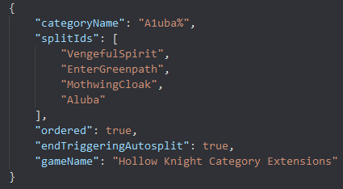
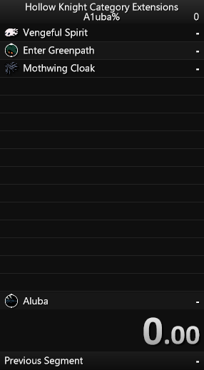
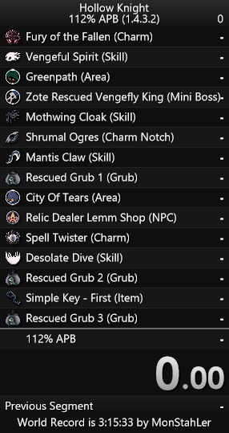
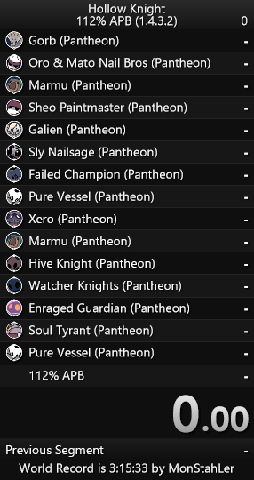

# hk split maker

Write a small configuration for Hollow Knight splits and a produce a full LiveSplit file. List your triggers once, and get both the autosplitter settings and the segment list from that list!




## Use
As of this writing, you must clone the repository and install/build manually via [Node.js](https://nodejs.org/en/).

```sh
npm install && npm run build
```

Specify a config file and an output file, like so:
```sh
$ node build/main.js sample-configs/112-apb.json splits.lss
Reading from sample-configs/112-apb.json
Writing to splits.lss
Done!
```





## Future Enhancements
- Check config schema at runtime to prevent invalid split data
- Support subsplits
- Create a self-service web ui
  - Basic - paste in a config JSON and download the generated `.lss` file
  - Interactive - search for splits
