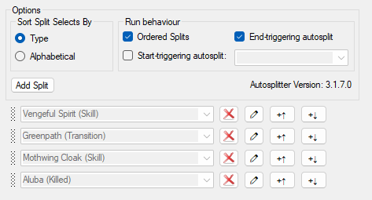

#  HK Split Maker

Write a small configuration for Hollow Knight splits and a produce a full LiveSplit file. List your triggers once, and get both the autosplitter settings and the segment list from that list!

The configuration is as simple as this. List the autosplit triggers once and add some metadata.


The resulting splits have icons!


The autosplits are ordered and correct.



## Use

Use the [HK Split Maker web UI](https://hksplitmaker.com/)!
You can load a builtin category or customize your own.
Once the configuration is loaded or written, click Generate then Download.
Open the resulting lss file with LiveSplit.

## Development

For development or local use, clone the repository and install/build manually via [Node.js](https://nodejs.org/en/).

```sh
npm install --legacy-peer-deps && npm run serve
```

Navigate to `http://localhost:8080/` in your web browser.

### Adding New and Updated Autosplits for Hollow Knight

1. Copy the contents of `public enum SplitName` from
   [HollowKnightSplitSettings.cs](https://github.com/ShootMe/LiveSplit.HollowKnight/blob/master/HollowKnightSplitSettings.cs) into [splits.txt](./src/asset/hollowknight/splits.txt).
2. Remove the commented-out lines. At this point, `git diff` should only list the new (or updated) autosplits.
3. Update [hollowknight-gen-files.js](./tools/hollowknight-gen-files.js) to ensure each new autosplit is mapped to an icon. Optionally, add new icons to the [icons/](./src/asset/hollowknight/icons) directory.
4. Run `npm run gen-files` to regenerate the core files from these updates.
5. Run `npm run serve` to make sure the application runs.
6. You can use [every.json](./src/asset/hollowknight/categories/every.json) as a test case, or construct a new test case containing the new splits.
7. Ensure the generated splits have the correct autosplits.

For an example of this process, see https://github.com/slaurent22/hk-split-maker/pull/125

### Adding New and Updated Autosplits for Silksong

1. Ensure [splits.json](https://github.com/AlexKnauth/silksong-autosplit-wasm/blob/master/examples/splits.json) is up-to-date.
2. Copy [splits.json](https://github.com/AlexKnauth/silksong-autosplit-wasm/blob/master/examples/splits.json) into [splits.json](./src/asset/silksong/splits.json).
3. TBD

## Future Enhancements

You can see the current list of feature ideas in the [GitHub
issues](https://github.com/slaurent22/hk-split-maker/issues). More ideas are
welcome!
